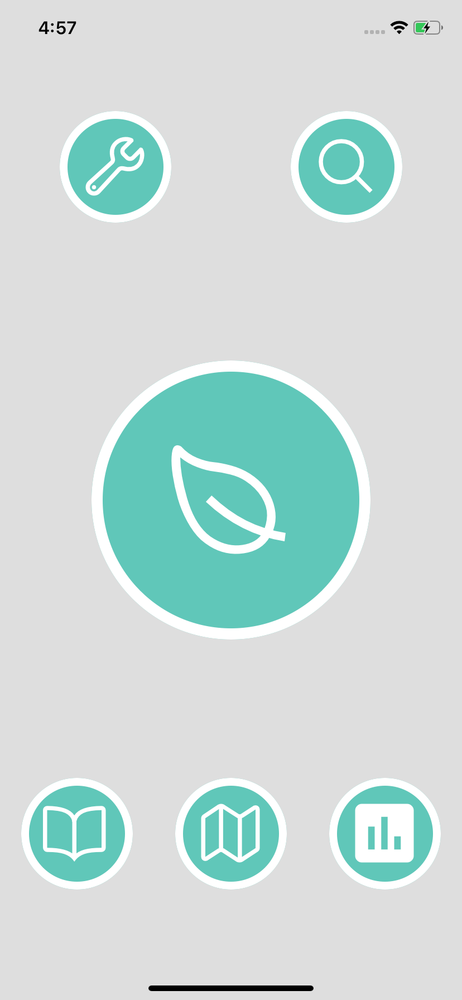
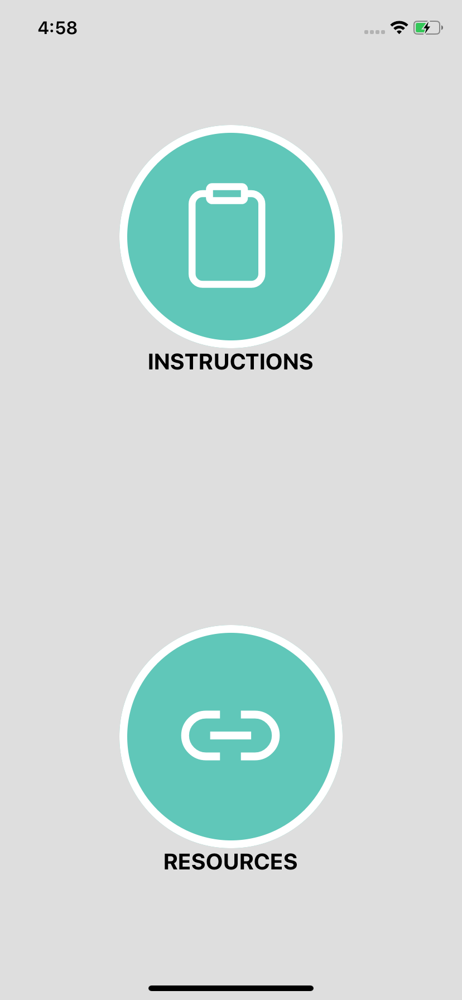
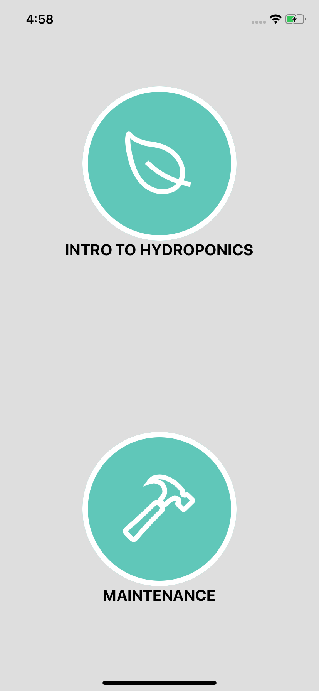

# AgroSENSE Mobile App

## OverView 
The AgroSENSE app is a complete guide for users to build and maintain a hydroponics system. Users are given a step-by-step video and written instructions to build their ideal system. In addition, the app also contains maintenance guides for hydroponics and healthy cooking recipes.

## Design
The AgroSENSE mobile app is built to help users set up their own hydroponics system with ease. Users first take a survey to generate their ideal systems by taking into account their specific parameters: type of fish, plants, size, budget, and various other factors.Upon completion of the survey, users will be given written instructions and a tutorial video to start the building process. The app is split into 2 sections: Builder’s Guide and Community Guide. The Builder’s Guide includes all the information users will need to set up their own aquaponics/hydroponics system. The Community Guide serves as the education portion; it addresses certain topics such as how to maintain the system and include the AgroEats cookbook, containing a diverse array of recipes using the plants harvested from their system. AgroSENSE’s  Builder’s and Community Guides  serve as a perfect introduction to hydroponics for beginners.


## Images



*Home page of the app. Top left bubble is the builder's guide. Top right bubble is the community guide. Bottom left bubble is the cookbook. Bottom center bubble is the maps section. Bottom right bubble is the survey section. Center bubble is information about the hydroponics system.*



*Builder's Guide section of the app, giving instructions about building a hydroponics system.*



*Community Guide section of the app, educating people about hydroponics.*


*Cookbook section of the app, showing recipes with hydroponics-grown ingredients.*

## Installation
Download the project files to your computer

### Mac - Android or iOS
1. Open Terminal and navigate to the project folder
1. To run the app on the iOS Simulator, Xcode must be installed with a valid signing profile. Enter the following command in the terminal: 
```
npx react-native run-ios
```

Run the app on the iOS Simulator by opening the .xcworkspace file and clicking the play button at the top of the screen. To run on a physical iOS device, plug the device into the Mac and choose the device from the dropdown menu at the top of the screen.


To run on an Android simulator, simply use the following command or open Android Studio and run the app manually.
```
npx react-native run-android
```

### Windows - Android
1. To run the app on the Android simulator, open a command prompt window and navigate to the project folder
2. Run the following command: 
```
npx react-native run-android
```
To run on a physical Android device, plug in the device into the computer and use Android Studio to manually run the app onto the device.


Note to user: The Maps feature will be available in a future version of the AgroSENSE app.